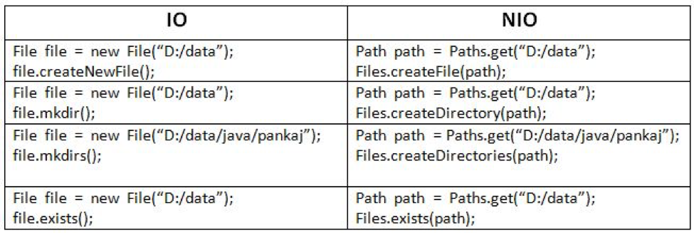

# Programación - 07 Ficheros y formatos de intercambio

Tema 07 Ficheros y formatos de intercambio. 1DAM. Curso 2022/2023.


- [Programación - 07 Ficheros y formatos de intercambio](#programación---07-ficheros-y-formatos-de-intercambio)
  - [Contenidos](#contenidos)
  - [Ficheros](#ficheros)
    - [Try-Catch con recursos](#try-catch-con-recursos)
    - [Use](#use)
    - [Flujos](#flujos)
  - [Ficheros de texto](#ficheros-de-texto)
    - [Leer ficheros de texto](#leer-ficheros-de-texto)
    - [Escribir ficheros de texto](#escribir-ficheros-de-texto)
  - [Ficheros binarios](#ficheros-binarios)
    - [Leer ficheros binarios](#leer-ficheros-binarios)
    - [Escribir ficheros binarios](#escribir-ficheros-binarios)
  - [Ficheros de acceso aleatorio](#ficheros-de-acceso-aleatorio)
    - [Leer ficheros de acceso aleatorio](#leer-ficheros-de-acceso-aleatorio)
    - [Escribir ficheros de acceso aleatorio](#escribir-ficheros-de-acceso-aleatorio)
  - [Serialización](#serialización)
    - [Leer objetos serializados](#leer-objetos-serializados)
    - [Escribir objetos serializados](#escribir-objetos-serializados)
  - [Ficheros y Directorios. Utilidades](#ficheros-y-directorios-utilidades)
    - [Clase File](#clase-file)
    - [Clase Path](#clase-path)
    - [Clase Files](#clase-files)
    - [Clase Paths](#clase-paths)
    - [Directorio Resources](#directorio-resources)
    - [Fichero properties](#fichero-properties)
  - [CSV](#csv)
  - [JSON](#json)
    - [Lectura de JSON](#lectura-de-json)
    - [Escritura de JSON](#escritura-de-json)
    - [Pretty print](#pretty-print)
    - [Adaptadores](#adaptadores)
  - [XML](#xml)
    - [Lectura de XML](#lectura-de-xml)
    - [Escritura de XML](#escritura-de-xml)
  - [DTO](#dto)
  - [Recursos](#recursos)
  - [Autor](#autor)
    - [Contacto](#contacto)
    - [¿Un café?](#un-café)
  - [Licencia de uso](#licencia-de-uso)

## Contenidos

1. Ficheros
2. Ficheros de texto
3. Ficheros binarios
4. Ficheros de acceso aleatorio
5. Serialización de objetos
6. Ficheros y Directorios. Utilidades
7. CSV
8. JSON
9. XML
10. DTO

## Ficheros
Un fichero es un conjunto de datos almacenados en un dispositivo de almacenamiento secundario. Los ficheros se pueden clasificar en dos grandes grupos: ficheros de texto y ficheros binarios y en función de su acceso: ficheros de acceso secuencial y ficheros de acceso aleatorio.

### Try-Catch con recursos
A partir de Java 7 se puede utilizar el try-catch con recursos, que nos permite cerrar los recursos que se abren en el bloque try. Para ello, se debe implementar la interfaz java.lang.AutoCloseable en la clase que queremos cerrar. Por ejemplo, si queremos cerrar un fichero, la clase que implementa la interfaz AutoCloseable es java.io.Closeable.

```java
try (BufferedReader br = new BufferedReader(new FileReader("fichero.txt"))) {
    // Acciones
} catch (IOException e) {
    // Excepciones
}

// Antes 
BufferedReader br = null;
try {
    br = new BufferedReader(new FileReader("fichero.txt"));
    // Acciones
} catch (IOException e) {
    // Excepciones
} finally {
    if (br != null) {
        try {
            br.close();
        } catch (IOException e) {
            // Excepciones
        }
    }
}
```
En el ejemplo anterior, el fichero se cierra automáticamente al salir del bloque try. Si se produce una excepción, el fichero se cierra automáticamente al salir del bloque catch.

### Use
En Kotlin podemos usar el uso de recursos de una forma más sencilla y segura. Para ello, usamos la función use, que nos permite cerrar el recurso automáticamente al salir del bloque de código.

```kotlin
File("fichero.txt").bufferedReader().use { br ->
    // Acciones
}
```

### Flujos
Flujos: son un canal de comunicación de las operaciones de entrada salida. Este esquema nos da independencia para poder trabajar igual tanto si estamos escribiendo en un fichero, como en consola, o si estamos leyendo de teclado, o de una conexión de red.
- Flujos de entrada: sirven para introducir datos en la aplicación.
- Flujos de salida: sirven para sacar datos de la aplicación.
- Flujos de bytes: manejan datos en crudo.
- Flujos de caracteres: manejan caracteres o cadenas


## Ficheros de texto
Los ficheros de texto son ficheros que contienen caracteres. Los ficheros de texto se pueden leer y escribir.

### Leer ficheros de texto
Podemos leerlos linea a linea o todo el fichero de golpe. Ademas podemos hacer uso de un buffer para mejorar la lectura.
Debes tener en cuenta cómo se implementan los métodos de lectura, pues mucho de ellos aunque no lo parezca hacen uso del buffer de lectura internamente. como radLines(), forEachLine{ } o readText().
```kotlin
val fileOrigen = File(filePath)

// existe
if (fileOrigen.exists()) {
    println("El fichero existe")
} else {
    println("El fichero no existe")
}

// Si puedo leerlo
if (fileOrigen.canRead()) {
    println("El fichero se puede leer")
} else {
    println("El fichero no se puede leer")
}

// Devuelve una lista de líneas
fileOrigen.readLines().forEach { println(it) }
println()

// Procesa linea a linea, es la forma simplificada del anterior
fileOrigen.forEachLine { println(it) }

// Lee el fichero completo en una cadena, cuidado con ficheros grandes
fileOrigen.readText().also { println(it) }

// Usa usa una secuencia y se le procesa un callback en el lambda
fileOrigen.useLines { it.toList() }.forEach { println(it) }
// fileOrigen.useLines { it.forEach { line -> println(line) } }

// Buffer de lectura
// Lee el fichero completo en una lista de cadena
fileOrigen.bufferedReader().forEachLine { println(it) }
// Use equivale al try-with-resources de Java
// Dentro del use podemos hacer uso de los métodos de BufferedReader
fileOrigen.bufferedReader().use { it.forEachLine { line -> println(line) } }

// InputStreamReader
fileOrigen.inputStream().reader().readText().let { println(it) }

// InputStream + BufferedReader
fileOrigen.inputStream().bufferedReader().readText().let { println(it) }

// InputStreamReader + BufferedReader + use
fileOrigen.inputStream().reader().buffered().use { it.readText() }.let { println(it) }
```

### Escribir ficheros de texto
Podemos escribirlos linea a linea o todo el fichero de golpe. Ademas podemos hacer uso de un buffer para mejorar la escritura. Haremos uso de writeText() o appendText() para escribir ficheros de texto. Debes tener en cuenta cómo se implementan los métodos de escritura, pues mucho de ellos aunque no lo parezca hacen uso del buffer de escritura internamente. 

```kotlin
val fileDestino = File(filePath)

// Con writeText escribimos todo el contenido  de String en el fichero, si existe lo sobreescribe, si no existe lo crea
fileDestino.writeText("Hola mundo")

// Podemos añadir contenido al fichero
fileDestino.appendText("Hola de nuevo")

// Podemos usar el método writeBytes para escribir bytes
fileDestino.writeBytes("Hola mundo".toByteArray())

// printWriter
fileDestino.printWriter().use { it.println("Hola mundo") }

// bufferedWriter
fileDestino.bufferedWriter().use { it.write("Hola mundo") }

// bufferedWriter + append
fileDestino.bufferedWriter().use { it.append("Hola mundo") }

// printWriter + append
fileDestino.printWriter().use { it.append("Hola mundo") }
```

## Ficheros binarios
Los ficheros binarios son ficheros que contienen bytes. Los ficheros binarios se pueden leer y escribir. También poder usar este sistema para leer y escribir ficheros de texto.

### Leer ficheros binarios
Podemos leerlos byte a byte o todo el fichero de golpe. Ademas podemos hacer uso de un buffer para mejorar la lectura. Haremos uso de readBytes(), read()

```kotlin
val fileOrigen = File(filePath)

// readBytes
val bytes = fileOrigen.readBytes().toString(Charsets.UTF_8)

// con un inputStream
fileOrigen.inputStream().use { println(it.readBytes().toString(Charsets.UTF_8)) }

// con buffered
fileOrigen.inputStream().buffered().use { println(it.readBytes().toString(Charsets.UTF_8)) }
```

### Escribir ficheros binarios
Poder escribirlos byte a byte o todo el fichero de golpe. Ademas podemos hacer uso de un buffer para mejorar la escritura. Haremos uso de writeBytes(), write()

```kotlin
val fileDestino = File(filePath)

// writeBytes
fileDestino.writeBytes("Hola mundo!".toByteArray())

// outputStream
fileDestino.outputStream().use { it.write("Hola mundo!".toByteArray()) }

// bufferedOutputStream
fileDestino.outputStream().buffered().use { it.write("Hola mundo!".toByteArray()) }

// con bufferedWriter
fileDestino.bufferedWriter().use { it.write("Hola mundo!") }
```

## Ficheros de acceso aleatorio
Los ficheros de acceso aleatorio son ficheros que contienen bytes. No acceden a los datos de forma secuencial, sino que se puede acceder a cualquier parte del fichero. Los ficheros de acceso aleatorio se pueden leer y escribir. También poder usar este sistema para leer y escribir ficheros de texto.

Haremos uso de RandomAccessFile y de las funciones seek(), para mover el puntero de lectura/escritura, y read(), write() para leer y escribir.

¿Cómo saber la longitud de un fichero de acceso aleatorio y del tipo de dato?
|Tipo de Dato|Tamaño en Bytes|
|---|---|
|Char|2 bytes|
|Byte|1 byte|
|Short|2 bytes|
|Int|4 bytes|
|Long|8 bytes|
|Float|4 bytes|
|Double|8 bytes|
|Boolean|1 byte|
|Espacio en blanco (un char)|1 byte|
|Salto de línea (enter)|1 byte|
|String|2 bytes por cada char|


### Leer ficheros de acceso aleatorio
Podemos leerlos byte a byte o todo el fichero de golpe. Ademas podemos hacer uso de un buffer para mejorar la lectura. Haremos uso de los métodos de readInt(), readLong(), readFloat(), readDouble(), readChar(), readBoolean(), readByte(), readShort(), readUTF()

```kotlin
val aleatorio = RandomAccessFile(fileOrigen, "rw")
    // leermos una secuencia de numeros enteros
aleatorio.use {
    it.seek(0) // Nos situamos al principio del fichero si no lo está
    val longitud = it.length() // Obtenemos la longitud del fichero
    val numEnteros = longitud / 4 // Obtenemos el número de enteros 4 bytes = 1 entero de 32 bits
    val arrayEnteros = IntArray(numEnteros.toInt()) // Creamos un array de enteros
    for (i in 0 until numEnteros) {
        arrayEnteros[i] = it.readInt() // Leemos el entero
    }
}
```
### Escribir ficheros de acceso aleatorio
Poder escribirlos byte a byte o todo el fichero de golpe. Ademas podemos hacer uso de un buffer para mejorar la escritura. Haremos uso de los métodos de writeInt(), writeLong(), writeFloat(), writeDouble(), writeChar(), writeBoolean(), writeByte(), writeShort(), writeUTF()

```kotlin
val aleatorio = RandomAccessFile(fileOrigen, "rw")
    // Escribimos una secuencia de numeros enteros
aleatorio.use {
    it.seek(0) // Nos situamos al principio del fichero si no lo está
    for (i in 0 until 10) {
        it.writeInt(i) // Escribimos el entero
    }
}
```

## Serialización
La serialización es el proceso de convertir un objeto en una secuencia de bytes para poder almacenarlo en un fichero, enviarlo a través de una red o guardarlo en una base de datos. La deserialización es el proceso inverso, de convertir una secuencia de bytes en un objeto. Para poder serializar un objeto, este debe implementar la interfaz Serializable y sus atributos deben ser también serializables. 

### Leer objetos serializados
Para leer objetos serializados haremos uso de ObjectInputStream y del readObject() para leer el objeto o colección de objetos haciendo un casting adecuado.

```kotlin
data class Persona(val nombre: String, val edad: Int) : Serializable

val fileOrigen = File(filePath)

val ois = ObjectInputStream(fileOrigen.inputStream())
ois.use {
    val persona = it.readObject() as Persona
    println(persona)
}
```

### Escribir objetos serializados
Para escribir objetos serializados haremos uso de ObjectOutputStream y del writeObject() para escribir el objeto o colección de objetos.

```kotlin
data class Persona(val nombre: String, val edad: Int) : Serializable

val fileDestino = File(filePath)

val oos = ObjectOutputStream(fileDestino.outputStream())
oos.use {
    it.writeObject(Persona("Pepe", 20))
}
```

## Ficheros y Directorios. Utilidades

### Clase File
La clase File representa un fichero o directorio en el sistema de ficheros. La clase File proporciona métodos para crear, eliminar, renombrar, comprobar si existe, obtener información sobre un fichero o directorio, y para obtener una lista de los ficheros y directorios que contiene un directorio.


### Clase Path
La clase Path representa una ruta de acceso a un fichero o directorio y nos ofrece métodos para trabajar con rutas

### Clase Files
La clase Files proporciona métodos estáticos para trabajar con ficheros y directorios usando Nio2, y con ello poder usar api de Streams, Paths, etc de una manera no bloqueante.



### Clase Paths
Nos permite obtener un objeto Path a partir de una cadena de texto que representa una ruta de acceso a un fichero o directorio en el sistema de ficheros usando Nio2.

```kotlin
// Dado un path si es un directorio nos devuelve una lista de los ficheros que contiene
val path = Paths.get("...")
val files = Files.list(path)
// comprobamos por cada fichero si es un fichero o directorio y si podemos leerlo
files.forEach {
    if (Files.isDirectory(it)) {
        println("Es un directorio")
    } else if (Files.isRegularFile(it)) {
        println("Es un fichero")
    }
    if (Files.isReadable(it)) {
        println("Es legible")
    }
}

// simular el comando ls -l
Files.list(path).forEach {
    println("${Files.getLastModifiedTime(it)} ${Files.size(it)} ${it.fileName}")
}

// simular el comando tree
Files.walk(path).forEach {
    println("${Files.getLastModifiedTime(it)} ${Files.size(it)} ${it.fileName}")
}
```

### Directorio Resources
En el directorio resources podemos almacenar ficheros que queramos que estén disponibles en el classpath de nuestro proyecto. Estos ficheros se pueden acceder desde el código de la aplicación usando la clase ClassLoader. Son muy útiles para almacenar ficheros de configuración, ficheros de datos, etc, pero solo de lectura. Estará disponible en el classpath de nuestro proyecto (incluso dentro del jar) y por tanto podremos acceder a él desde cualquier parte de nuestro proyecto.

```kotlin
fun getResourceText(path: String): String {
    return File(ClassLoader.getSystemResource(path).file).readText()
}
```

### Fichero properties
Los ficheros properties son ficheros de texto plano que contienen pares clave-valor. Estos ficheros son muy útiles para almacenar configuraciones de nuestra aplicación. Para poder leerlos haremos uso de la clase Properties.

```kotlin
val properties = Properties()
properties.load(ClassLoader.getSystemResourceAsStream("config.properties"))
val nombre = properties.getProperty("nombre")
val edad = properties.getProperty("edad").toInt()

// Si queremos guardar un fichero properties
val properties = Properties()
properties.setProperty("nombre", "Pepe")
properties.setProperty("edad", "20")
properties.store(FileOutputStream("config.properties"), "Fichero de configuración")
```

## CSV
Los ficheros CSV (Comma Separated Values) son ficheros de texto plano que contienen datos separados por comas u otro delimitador. Estos ficheros son muy útiles para almacenar datos de forma sencilla y que puedan ser leídos por cualquier aplicación. Para poder leerlos como un fichero de texto y separar los datos por el limitador. Posteriormente podemos convertirlos a objetos.
```kotlin
// Leemos un fichero CSV
val file = File(filePath)
file.forEachLine {
    val datos = it.split(",") // Separamos los datos por comas
    println(datos)
}

// Escribimos un fichero CSV
val file = File(filePath)
file.writeText("Pepe,20\n")
file.appendText("Juan,30\n")
```

## JSON
Los ficheros JSON (JavaScript Object Notation) son ficheros de texto plano que contienen datos en formato JSON. Estos ficheros son muy útiles para almacenar datos de forma sencilla y que puedan ser leídos por cualquier aplicación. Para poder leerlos como un fichero de texto y convertirlos a objetos.
```json
{
  "nombre": "Pepe",
  "edad": 20
}
```

### Lectura de JSON
Para poder leer un fichero JSON haremos uso de la librería [Moshi](https://github.com/square/moshi). [Esta librería](https://www.baeldung.com/java-json-moshi) nos permite [convertir objetos a JSON y viceversa](https://www.baeldung.com/kotlin/moshi-json-library) y es optima para trabajar con Kotlin y Java. Además podemos usar otras como [Kotlin serialzation](https://kotlinlang.org/docs/serialization.html#example-json-serialization) pero solo es compatible con Kotlin. OJO, la recomiendo mucho más que Moshi si solo vas a trabajar con Kotlin.

La sintaxis específica de Kotlin requiere una anotación opcional @ExperimentalStdlibApi en la parte superior de nuestra clase o método que use Moshi. Esto es debido a que Moshi utiliza la API experimental de Kotlin para convertir los tipos de datos de Kotlin en tipos de datos de Java.


```kotlin
// Desde la cadena ya leída de un fichero
val json: String = File(filePath).readText()

val moshi: Moshi = Moshi.Builder().build()
val jsonAdapter: JsonAdapter<BlackjackHand> = moshi.adapter<BlackjackHand>()

val blackjackHand = jsonAdapter.fromJson(json)
println(blackjackHand)
```
### Escritura de JSON
Para poder escribir un fichero JSON haremos uso de la librería Moshi o de Kotlin Serialization.

    
```kotlin
val blackjackHand = BlackjackHand(
    Card('6', SPADES),
    listOf(Card('4', CLUBS), Card('A', HEARTS))
)

val moshi: Moshi = Moshi.Builder().build()
val jsonAdapter: JsonAdapter<BlackjackHand> = moshi.adapter<BlackjackHand>()

val json: String = jsonAdapter.toJson(blackjackHand)
// si queremos pretty print
val json: String = jsonAdapter.indent("  ").toJson(blackjackHand)
println(json)
File(filePath).writeText(json)
```

### Pretty print
Para poder hacer un pretty print de nuestro JSON haremos uso de la función indent de la clase JsonAdapter.
También podemos usar una función de extensión para hacerlo más sencillo.

```kotlin
val json: String = jsonAdapter.indent("  ").toJson(blackjackHand)

// Función de extensión
fun <T> JsonAdapter<T>.toPrettyJson(value: T) = this.indent("  ").toJson(value)

// y ya podemos usar
val json = jsonAdapter.toPrettyJson(blackjackHand)
```

### Adaptadores
Algunos tipos de datos no son compatibles con Moshi o Kotlin Serialization. Para poder convertirlos a JSON y viceversa haremos uso de adaptadores. Estos casos los tenemos en los tipos de datos como UUID, LocalDate

```kotlin
class UuidAdapter : JsonAdapter<UUID>() {
    @FromJson
    override fun fromJson(reader: JsonReader): UUID? = UUID.fromString(reader.readJsonValue().toString())

    @ToJson
    override fun toJson(writer: JsonWriter, value: UUID?) {
        writer.jsonValue(value.toString())
    }
}

class LocalDateAdapter : JsonAdapter<LocalDate>() {
    @FromJson
    override fun fromJson(reader: JsonReader): LocalDate? = LocalDate.parse(reader.readJsonValue().toString())

    @ToJson
    override fun toJson(writer: JsonWriter, value: LocalDate?) {
        writer.jsonValue(value.toString())
    }
}

class LocalDateTimeAdapter : JsonAdapter<LocalDateTime>() {
    @FromJson
    override fun fromJson(reader: JsonReader): LocalDateTime? = LocalDateTime.parse(reader.readJsonValue().toString())

    @ToJson
    override fun toJson(writer: JsonWriter, value: LocalDateTime?) {
        writer.jsonValue(value.toString())
    }
}


val moshi: Moshi = Moshi.Builder()
    .add(UuidAdapter())
    .add(LocalDateAdapter())
    // otros adaptadores
    .build()

```

## XML
Los ficheros XML (Extensible Markup Language) son ficheros de texto plano que contienen datos en formato XML. Estos ficheros son muy útiles para almacenar datos de forma sencilla y que puedan ser leídos por cualquier aplicación. Para poder leerlos como un fichero de texto y convertirlos a objetos.
```xml
<?xml version="1.0" encoding="UTF-8"?>
<persona>
    <nombre>Pepe</nombre>
    <edad>20</edad>
</persona>
```

### Lectura de XML
Para leer ficheros XML usaremos la librería [Simple XML](https://simple.sourceforge.net/). Esta librería nos permite convertir objetos a XML y viceversa y es optima para trabajar con Kotlin y Java. Además podemos usar otras como [Kotlin serialzation](https://kotlinlang.org/docs/serialization.html#example-xml-serialization) pero solo es compatible con Kotlin. OJO, la recomiendo mucho más que Simple XML si solo vas a trabajar con Kotlin y así la usaremos en un futuro.

```kotlin
data class Paciente(
    val uuid: UUID = UUID.randomUUID(),
    val nombre: String,
    val edad: Int,
    val createdAt: LocalDateTime = LocalDateTime.now(),
)

// Para evitar los problemas de los tipos usamos un DTO con los tipos String
// Field es para poder escribir y param para crear el constructor
@Root(name = "paciente")
data class PacienteDto(
    @field:Attribute(name = "uuid") // es un atributo
    @param:Attribute(name = "uuid") // es un atributo
    val uuid: String,

    @field:Element(name = "nombre") // Si queremos cambiar el nombre del elemento
    @param:Element(name = "nombre") // Si queremos cambiar el nombre del elemento
    val nombre: String,

    @field:Element(name = "edad")
    @param:Element(name = "edad")
    val edad: String,

    @field:Element(name = "created_at")
    @param:Element(name = "created_at")
    val createdAt: String,
)

// Ademas de la clase Paciente, necesitamos una clase que se encargue de convertir
// entre Paciente y PacienteDTO
fun Paciente.toDto() = PacienteDto(
    uuid = uuid.toString(),
    nombre = nombre,
    edad = edad.toString(),
    createdAt = createdAt.toString(),
)

fun PacienteDto.toPaciente() = Paciente(
    uuid = UUID.fromString(uuid),
    nombre = nombre,
    edad = edad.toInt(),
    createdAt = LocalDateTime.parse(createdAt),
)

// Para las listas, necesitamos una clase contenedora
@Root(name = "pacientes_list")
data class PacientesDto(
    @field:ElementList(name = "pacientes", inline = true) // inline para que no se cree un elemento contenedor
    @param:ElementList(name = "pacientes", inline = true) // inline para que no se cree un elemento contenedor
    val pacientes: List<PacienteDto>,
)

fun List<Paciente>.toDto() = PacientesDto(pacientes = map { it.toDto() })
fun PacientesDto.toPacientes() = pacientes.map { it.toPaciente() }


 // ....
 // Vamos con una lista
val pacientes = listOf(
    Paciente(nombre = "Juan", edad = 30),
    Paciente(nombre = "Ana", edad = 25),
    Paciente(nombre = "Luis", edad = 40),
    Paciente(nombre = "María", edad = 35),
)
val serializer = Persister()
serializer.write(pacientes.toDto(), File(fichero));
println("Escrito de $fichero2")

```

### Escritura de XML
Para escribir un XML usaremos las mismas librerías que para leerlo. Para escribir un XML usaremos la librería [Simple XML](https://simple.sourceforge.net/). Esta librería nos permite convertir objetos a XML y viceversa y es optima para trabajar con Kotlin y Java. Además podemos usar otras como [Kotlin serialzation](https://kotlinlang.org/docs/serialization.html#example-xml-serialization) pero solo es compatible con Kotlin. OJO, la recomiendo mucho más que Simple XML si solo vas a trabajar con Kotlin y así la usaremos en un futuro.

```kotlin
val serializer = Persister()
val pacientes = serializer
    .read(PacientesDto::class.java, File(fichero2))
    .toPacientes()
println(pacientes2)
```

## DTO
El DTO (Data Transfer Object) es un objeto que se utiliza para transferir datos entre distintas capas de una aplicación. En nuestro caso lo usaremos para transferir datos entre la capa de datos y la capa de negocio. De esta manera podemos prescindir de los adaptadores o incompatibilidades de tipos de datos (UUID, DateTime, LocalDateTime y otros).

Para pasar de uno modelo a su dto y viceversa haremos uso de las funciones de extensión de Kotlin o un objeto mapeador o para empaquetar y desempaquetar los datos (embeberlos en un objeto) y así poder usarlos en la capa de negocio. Muy util con Json y XML.


```kotlin
data class Persona(
    val id: UUID,
    val nombre: String,
    val edad: Int
    val createdAt: LocalDateTime
)

data class PersonaDto(
    val id: String,
    val nombre: String,
    val edad: String,
    val createdAt: String
)

fun Persona.toDto() = PersonaDto(
    id.toString(),
    nombre,
    edad.toString(),
    createdAt.toString()
)

fun PersonaDto.toModel() = Persona(
    UUID.fromString(id),
    nombre,
    edad.toInt(),
    LocalDateTime.parse(createdAt)
)
```

## Recursos

- Twitter: https://twitter.com/joseluisgonsan
- GitHub: https://github.com/joseluisgs
- Web: https://joseluisgs.github.io
- Discord del módulo: https://discord.gg/RRGsXfFDya
- Aula DAMnificad@s: https://discord.gg/XT8G5rRySU

## Autor

Codificado con :sparkling_heart: por [José Luis González Sánchez](https://twitter.com/joseluisgonsan)

[](https://twitter.com/joseluisgonsan)
[](https://github.com/joseluisgs)

### Contacto

<p>
  Cualquier cosa que necesites házmelo saber por si puedo ayudarte 💬.
</p>
<p>
 <a href="https://joseluisgs.github.io/" target="_blank">
        
    </a>  &nbsp;&nbsp;
    <a href="https://github.com/joseluisgs" target="_blank">
        
    </a> &nbsp;&nbsp;
        <a href="https://twitter.com/joseluisgonsan" target="_blank">
        
    </a> &nbsp;&nbsp;
    <a href="https://www.linkedin.com/in/joseluisgonsan" target="_blank">
        
    </a>  &nbsp;&nbsp;
    <a href="https://discordapp.com/users/joseluisgs#3560" target="_blank">
        
    </a> &nbsp;&nbsp;
    <a href="https://g.dev/joseluisgs" target="_blank">
        
    </a>    
</p>

### ¿Un café?

<p><a href="https://www.buymeacoffee.com/joseluisgs"> </a></p><br><br><br>

## Licencia de uso

Este repositorio y todo su contenido está licenciado bajo licencia **Creative Commons**, si desea saber más, vea la [LICENSE](https://joseluisgs.github.io/docs/license/). Por favor si compartes, usas o modificas este proyecto cita a su autor, y usa las mismas condiciones para su uso docente, formativo o educativo y no comercial.

<a rel="license" href="http://creativecommons.org/licenses/by-nc-sa/4.0/"></a><br /><span xmlns:dct="http://purl.org/dc/terms/" property="dct:title">JoseLuisGS</span> by <a xmlns:cc="http://creativecommons.org/ns#" href="https://joseluisgs.github.io/" property="cc:attributionName" rel="cc:attributionURL">José Luis González Sánchez</a> is licensed under a <a rel="license" href="http://creativecommons.org/licenses/by-nc-sa/4.0/">Creative Commons Reconocimiento-NoComercial-CompartirIgual 4.0 Internacional License</a>.<br />Creado a partir de la obra en <a xmlns:dct="http://purl.org/dc/terms/" href="https://github.com/joseluisgs" rel="dct:source">https://github.com/joseluisgs</a>.
